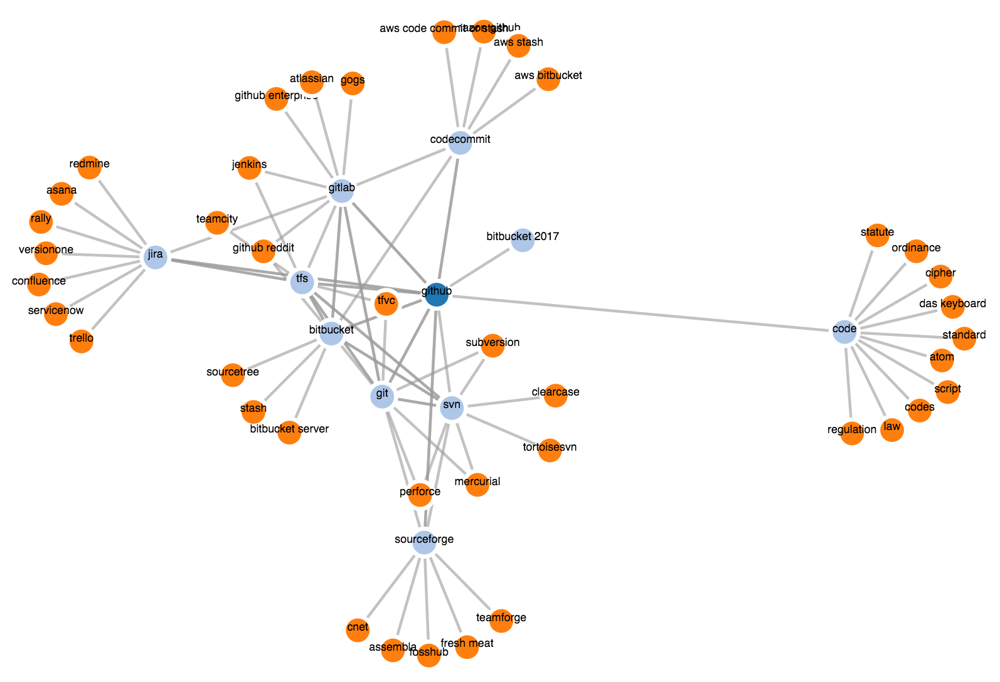

# google_vs_graph
Quick project that uses Google Suggest API to build a graph of terms Google considers competitors

I put this together for comparison research that I do alot. My typical method of doing this is googling "subject vs" and looking through google's suggestions to view alternatives.

This builds a graph of the suggested terms Google returns and the results from those terms, so it returns first and second degree related terms to the original search term.

It'd be cool to have this all running in the browser with a search interface, and have the ability to extend the graph by double clicking a node. All relatively easy, but this already solves 95% of my use case, so I'm stopping here. Feel free to contribute though!

## Example Usage
```
. compare.sh github
```


```
. compare.sh superman
```


